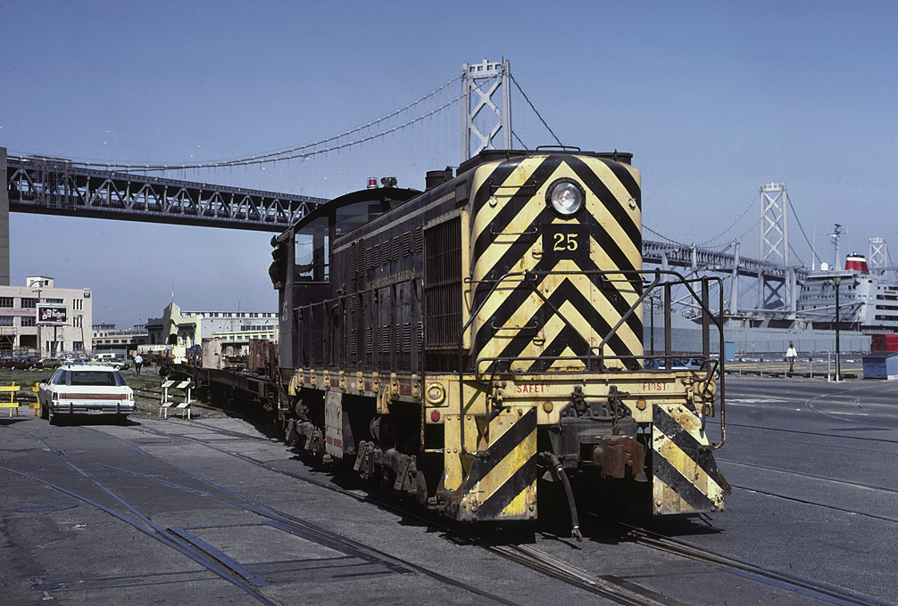
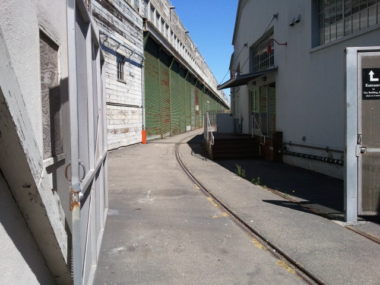
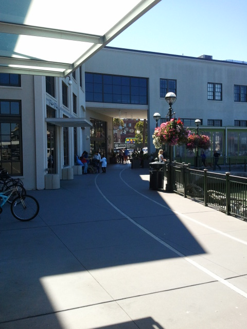
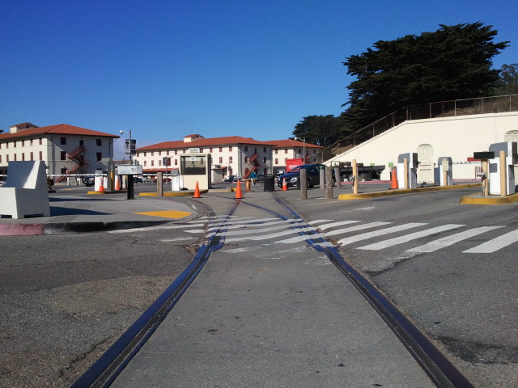

San Francisco Belt Railroad
===========================

:Author: Martin Atkins
:Abstract: Despite two total revamps of the street layout, San
     Francisco's Embarcadero retains evidence of the Port of San Francisco's
     shortline freight railroad.
:Date: 2012-09-03
:City: San Francisco
:Keywords: railroad, State Belt Railroad, SBRR, SFBRR, Toonerville Trolley,
     Wooden Axle Line
:Main Image: trainunderbaybridge.jpg

   A State Belt Railroad locomotive waits while cargo is unloaded
   onto a ship bound for China.

   `Photo by Drew Jacksich <http://www.flickr.com/photos/28101583@N07/4190927547/>`_

As of its incorporation in 1850, San Franciso's waterfront had many commercial
wharves, but the natural profile of the shoreline was steep and jagged, making it
difficult to access by both land and sea. In 1863 the Board of State Harbor
Commisioners set about bringing a more consistent shoreline to the San Francisco
waterfront via the construction of a seawall, which eventually created the smooth,
flat contour of today's Embarcadero.

The *State Belt Railroad* was founded in 1889 to connect the wharves of the
Port of San Francisco with several regional railroads including the Western Pacific,
the Santa Fe, and the Northwestern Pacific Railroads. Initially the State Belt
had no direct rail connection to any other railroad, with freight cars instead
being shipped by ferry barges launched from loading slips at Fisherman's Wharf.

   Several of the port's piers still sport SBRR rails, though most are only
   visible behind locked gates and fences.

   Photo by Martin Atkins

The State Belt would see its first direct rail connection much later, when in
1913 the Southern Pacific Railroad, using the right of way now used by the Caltrain
commuter rail service, connected with the port's rail line via an interchange at
3rd and King streets.

At its peak, the State Belt railroad had tracks spanning all the way from
Crissy Field to China Basin, providing freight rail service to the military
facilities in the Presidio and at Fort Mason as well as delivering materials needed
for the construction of the 1915 Panama-Pacific World's Fair in what we now know as
the Marina District.

The move to container shipping on large barges led to a migration of port business
to the Port of Oakland, and the State Belt's railroad operations began to wind
down. Because the city's sea wall had extended the shoreline beyond what existed
at the time of the city's incorporation, the Port had always been directly owned
by the State of California, but in 1969 the Port and its railroad were transferred
to City ownership and the railroad became known as the *San Francisco Belt Railroad*.

   This former track onto pier 3 is now a locomotive-sized pedestrian
   access for the public shore, several restaurants, and the
   boarding area for a cruise ship company.

   Photo by Martin Atkins

The Embarcadero has seen two major redevelopments since the heyday of the
Belt Railroad, first with the development of the double-deck Embarcadero freeway
along a large portion of the shoreline, and then later with its destruction and
the creation of the tree-lined boulevard we know as the Embarcadero today.
As a consequence of these large development projects, little evidence of the
former railroad remains in plain sight to those walking the San Francisco Bay Trail
between the Ferry Building and Fisherman's Wharf, but small reminders persist
to those who pay close attention.

Several small parking lots occupy oddly-shaped blocks that skirt the inner curve
of The Embarcadero, betraying the location of former storage yards and other
facilities that supported the railroad. More conspicuous is the office building
inside the elbow of Sansome St and the Embarcadero which began its life as
the State Belt's car roundhouse, where cosmetic rails have been retained in its
forecourt to commemorate its earlier pupose.

Moving west, the evidence is more pronounced: the exposed rails still present
in the pavement around Aquatic Park lead to the tunnel constructed under Fort Mason
Park. Despite efforts to pave over the tracks on the pathway just south of Marina
Green, wear and tear has revealed the path that trains formerly took to reach Crissy
Field and serve The Presidio.

   Tracks remain proud at Fort Mason, from its entrance and through the parking
   lot to the piers beyond.

   Photo by Martin Atkins

The railroad closed completely in 1993, after 20 years of operation by Kyle Railways
under contract to the City. Several former State Belt locomotives can be seen in the
collection at the Golden Gate Railway Museum in Hunter's Point, and the Muni Metro
and historic streetcar service on The Embarcadero are ensuring that there will
be rails of one form or another on The Embarcadeo for years to come.

References
----------

* `The State Belt Railroad - Switching Freight on San Francisco's Embarcadero <http://archived.ggrm.org/about_the_museum/history/statebelt.htm>`_ from *Golden Gate Railroad Museum*
* `The Port's Railroad Has the Best Connections <http://www.sfmuseum.org/hist8/beltrr.html>`_ from *Virtual Museum of the City of San Francisco*
* `The San Francisco Belt Railroad <http://www.abandonedrails.com/San_Francisco_Belt_Railroad>`_ from *Abandoned Rails*

