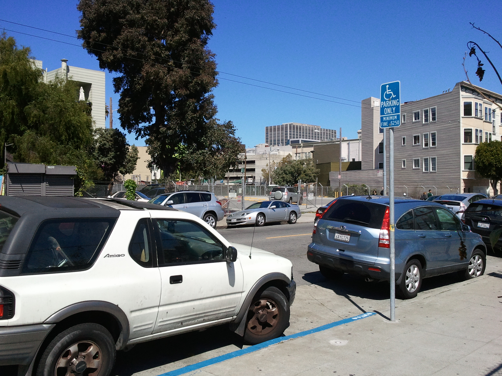

San Francisco's Freeway Revolt
==============================

:Author: Martin Atkins
:Abstract: The rise and demise of San Francisco's freeway plan.
:Date: 2012-09-09
:City: San Francisco
:Keywords: freeway, Central Freeway, Embarcadero Freeway, Transbay Terminal,
           California Route 480, Octavia Street, Octavia Boulevard,
           Hayes Valley
:Main Image: undercentralfreeway.jpg

   1948 San Francisco Trafficways Plan

   San Francisco Department of City Planning

In 1947 the Federal Bureau of Public Roads and the National Interregional Highway
Committee proposed a plan to construct freeways throughout the country and through
established cities. San Francisco was no exception, and was subject to a plan for
an elaborate network of expressways that would bisect the city.

The Central Freeway was planned to start at the Bayshore Freeway, run along
Webster St and then connect with the Golden Gate Bridge via the Panhandle
and Park Presidio St and to connect with the Embarcadero Freeway via Broadway.
The Embarcadero Freeway, meanwhile, was planned to connect the Bay Bridge with
the Golden Gate Bridge by following along the shoreline.

An initial part of the Central Freeway was opened in 1955, following a revised
route alongside Octavia St and ending in ramps at Oak and Fell Streets and at
Golden Gate and Turk Streets. An initial portion of the Embarcadero Freeway
was completed four years later, connecting with US-101 (the Bay Bridge) and
running north as far as Broadway Street, where a stub was constructed to allow
the freeway construction to continue further at a later date.

   Aerial view of the interchange between US-101 (the Bay Bridge) and the
   Embarcadero Freeway, before the freeway was destroyed.

   Photo by US Geological Survey

There was a resistance to the freeways from the start, but it wasn't until these
two structures were built that the objection gained critical mass. The San Francisco
Board of Supervisors passed several measures to halt further freeway construction
and they attempted to reverse the construction that had already occured, but
this proved politically difficult due to objections from merchants in the Richmond
and Sunset districts who feared a loss of business would result from the loss
of the freeways.

   A Muni streetcar passes under the Central Freeway on Market St, circa 1974.

   `Photo by Eric Fischer <http://www.flickr.com/photos/walkingsf/5545870610/>`_

The 1989 Loma Prieta earthquake damaged both structures, causing them both to
be immediately closed. The Central Subway was adapted into a single-deck structure
by removing the upper deck and closing the portion north of Fell St, but the
earthquake damage was ultimately the deciding factor in the total removal of the
entire Embarcadero Freeway and the demolition of the Central Freeway north
of Market St by 1996.

The Embarcadero Freeway had an elaborate interchange with US-101 near Folsom
St between Essex St and The Embarcadero. This, along with the ramps for the
recently-destroyed Transbay Transit Terminal, left several blocks completely
unoccupied. This land was used for little more than parking lots for several years,
but has at least seen some in-fill development and the construction of the
Transbay Temporary Terminal that will provide public transit links to the East Bay
until the Transbay Transit Center is completed.

   The three-block gorge left by the destruction of the Embarcadero Freeway's
   interchange with US-101. The foreground shows the Transbay Temporary Terminal
   occupying one of these blocks, but the others remain to be filled.

   Photo by Martin Atkins

   This corner parking lot, along with another parking lot out of sight under
   the US-101 deck in the distance, occupy the space previously taken up by the
   eastbound connection from US-101 to the Embarcadero Freeway.

   Photo by Martin Atkins

   This building near Essex St once backed onto the Embarcadero Freeway's connector
   to US-101. All that remains now is a largely-blank wall and, on the other
   side of the building, the off-ramp that now ends at Fremont St.

   Photo by Martin Atkins

The Central Freeway was replaced by a boulevard that accommodates two lanes each way
for access to the new freeway ramp at Octavia and Market Streets as well as
one lane each way of bike-friendly local access streets. The freeway access lanes
are separate from the local lanes by an attractive tree-lined median.

The portion of the Central Freeway north of Market St was originally constructed
alongside Octavia St, which remained as a normal city street despite being
overshadowed by the freeway. The destruction of the freeway structure therefore
left an unusually-wide space that allowed the construction of the 6-lane
boulevard that replaced it.

   The freeway took up so much space alongside Octavia St that even the new wide
   Boulevard leaves some some dead space that betrays the former location of
   the freeway.

   Photo by Martin Atkins

   Part of the Central Freeway on-ramp on Oak St is still present, and is — along
   with what remains of the corresponding off-ramp on Fell — now part of a community
   garden.

   Photo by Martin Atkins

   Despite the removal of this part of the freeway right after the 1989 earthquake,
   the connection to Golden Gate St remains a conspicuous gap in the buildings from
   Hayes all the way to Golden Gate. Some in-fill construction has started, but
   much of this land is still used only for parking.

   Photo by Martin Atkins

References
----------

* `Notorious SF: Freeway Revolt <http://www.mistersf.com/notorious/index.html?notfreeway.htm>`_ from *Mister SF*
* `3-digit Interstates: I-480 <http://www.kurumi.com/roads/3di/i480.html>`_ at karumi.com
* `Octavia Boulevard an asset to post-Central Freeway area <http://www.sfgate.com/bayarea/place/article/SAN-FRANCISCO-An-urban-success-story-Octavia-2659608.php>`_ at SFGate
* `Removing Freeways - Restoring Cities <http://www.preservenet.com/freeways/FreewaysCentral.html>`_

