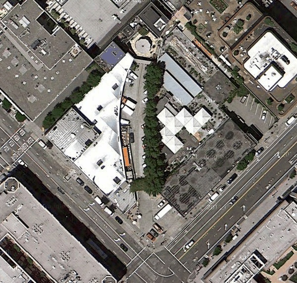
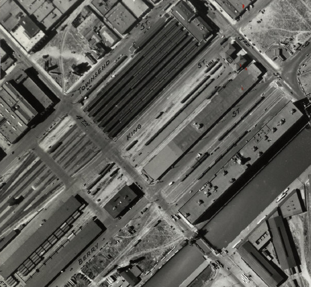
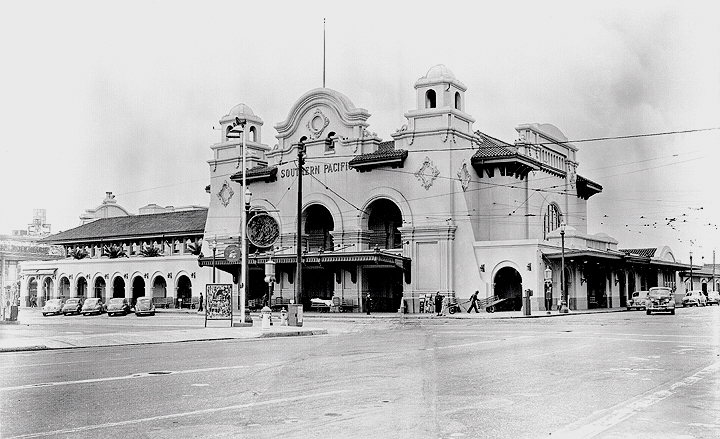

The Southern Pacific Railroad Depot in San Francisco
====================================================

:Author: Martin Atkins
:Abstract: Today's Caltrain ends in San Francisco at 4th and Townsend,
           but Caltrain's predecessor stretched further into the neighborhood.
:Date: 2012-09-07
:City: San Francisco
:Keywords: railroad, caltrain
:Section: scratches
:Main Image: depot-facade.jpg

I'm sure one day I'll do a more thorough article on the remnants of the
Southern Pacific Railroad throughout San Francisco, but for today I'll focus on
just the area immediately around what is today the San Francisco Caltrain station
at 4th and King.

Today's San Francisco terminal looks like a definite end of the line for Caltrain,
but in the early 20th century, when these tracks were still the property of the
Southern Pacific Railroad Company, trains were able to pass through this
point in a variety of different directions.

   This curved roadway through the block kitty-corner to the Caltrain
   Station is one of the few clues that the railroad used to continue
   beyond the current terminal at 4th Street.

   Imagery © 2012 Google, GeoEye, U.S. Geological Survey

Across Townsend St from the Caltrain station, between what is today the Creamery
coffee shop and the HD Buttercup furniture store, there is a curved cutting
between the two buildings that from street level just looks like a delivery
entrance, but from above betrays the path of a set of rails that proceeded
across the intersection of 4th and Townsend to what is now an alley at the end
of Lusk St and on to make a left turn onto Ritch St and straight ahead to cross
Third Street halfway between Townsend and Brannan Streets.

Meanwhile to the south another set of rails proceeded along King St to connect
with `the State Belt Railroad`_, though sadly
the reconstruction of King St into a wide boulevard for freeway access has left
little evidence of this visible today.

   Southern Pacific Railroad depot at 3rd and Townsend in 1938, also showing
   the tracks feeding out on to King St and across Townsend towards Ritch St.
   An extra street, known variously as "4th St West", "4½th St" and "New 4th St",
   was paved just to the west of 4th St to allow traffic to pass when
   longer trains blocked the "real" 4th St.

   Photo by Harrison Ryker; `scan from David Rumsey Map Collection`_

But the most significant extension beyond 4th Street, at least from the perspective
of rail passengers, was the extra block of trackage leading to the old depot and
terminal whose entrance was on 3rd Street between Townsend and King Streets.
This building, far more elegant in appearance than today's Caltrain station,
was the passenger entrance to the railway until it was closed in the 1970s.

The location at 3rd Street presented the problem that longer trains at the station
would extend across 4th Street into the next city block, preventing the passage
of road vehicles. The new terminal was constructed one block further back, facing
on to 4th Street. 5th Street was already blocked by railway infrastructure,
so long trains were no longer an issue.

   The Southern Pacific depot entrance at 3rd and Townsend Streets, circa 1950.

   Photo from `WX4 <http://wx4.org/to/foam/sp/san_fran/3rd/townsend.html>`_

Southern Pacific passenger service was taken over by Caltrans in 1980, after
the private company was no longer able to turn a profit on passenger service.
This new service was branded Caltrain, and it continues to serve peninsula
commuters today. Southern Pacific Railroad was incorporated into the Union Pacific
Railroad in 1996. There are plans to extend Caltrain service beyond its current
terminal to the new Transbay Transit Center in coming years, though this would be
via an underground tunnel rather via any historical Southern Pacific right of way
on the surface.

References
----------

* `Southern Pacific in San Francisco: Third & Townsend Depot <http://wx4.org/to/foam/sp/san_fran/3rd/townsend.html>`_

.. _scan from David Rumsey Map Collection: http://www.davidrumsey.com/luna/servlet/detail/RUMSEY~8~1~217069~5503076:15--San-Francisco-Aerial-Views,-Aug?sort=Pub_List_No_InitialSort%2CPub_Date%2CPub_List_No%2CSeries_No&qvq=q:aerial%2B1938%2B15;sort:Pub_List_No_InitialSort%2CPub_Date%2CPub_List_No%2CSeries_No;lc:RUMSEY~8~1&mi=16&trs=166

.. _the State Belt Railroad: /san-francisco-belt-railroad/

